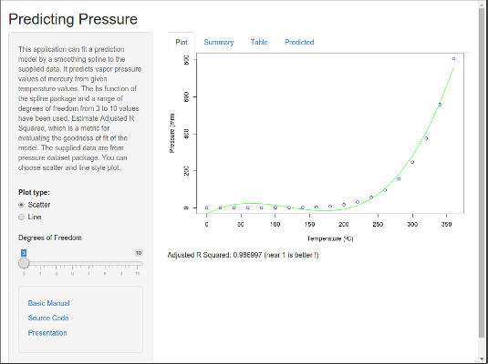
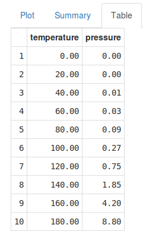
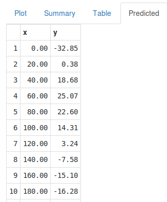
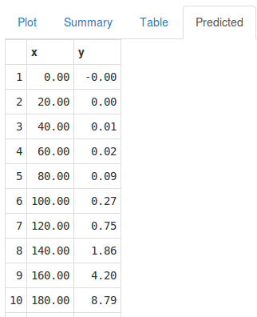

## Predicting Pressure Application. 

Overview

- It predicts vapor pressure values of mercury from given temperature values.
- The bs function of the spline package has been implemented.
- A range of degrees of freedom from 3 to 10 have been used. 
- Adjusted R Squared is estimated, which is a metric for evaluating the goodness of fit of the model.
- The supplied data are from pressure dataset package. 
- You can choose scatter and line style plot.

--- .class #id 

## Predicing Pressure View.

You can run Predicting Pressure App in <https://ae2015.shinyapps.io/predict_pressure/>.



When you change the degrees of freedom, the App estimates and plots the new predicted pressure values.

--- .class #id 

## Statistical Summary of Pressure Dataset.

The Summary tab shows some stats from the original pressure data.


```
##   temperature     pressure       
##  Min.   :  0   Min.   :  0.0002  
##  1st Qu.: 90   1st Qu.:  0.1800  
##  Median :180   Median :  8.8000  
##  Mean   :180   Mean   :124.3367  
##  3rd Qu.:270   3rd Qu.:126.5000  
##  Max.   :360   Max.   :806.0000
```

--- .class #id 

## Table Tab and Predicted Tab.

   

    
         
- The original and estimated values are displayed.
- The Adjusted R Squared for 3 and 8 degrees are showed.

